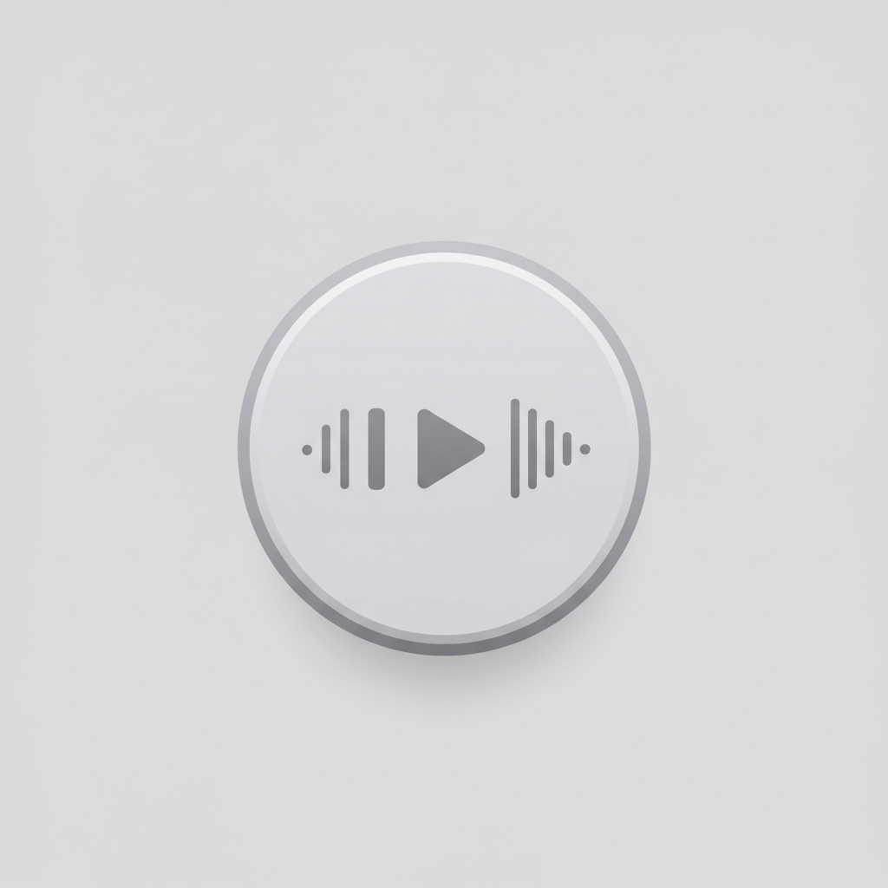

# 音乐播放器 (Music Player)

中文 | [English](README_EN.md)

一个使用Flutter开发的现代化音乐播放器应用，支持多平台（Android、iOS、Web和桌面）。



## 功能特点

- 🎵 **音乐播放控制**：播放、暂停、上一曲、下一曲
- 📋 **播放列表管理**：添加、删除和排序音乐
- 🔄 **进度条控制**：拖动进度条调整播放位置
- 💾 **本地存储**：自动保存播放列表，下次启动时恢复
- 🎨 **现代化UI**：优雅的渐变背景和流畅的动画效果
- 📱 **多平台支持**：适用于Android、iOS、Web和桌面平台

## 技术栈

- **Flutter**：跨平台UI框架
- **Provider**：状态管理
- **just_audio**：音频播放引擎
- **file_picker**：文件选择器
- **shared_preferences**：本地数据存储
- **path_provider**：文件路径管理

## 项目结构

```
lib/
├── main.dart              # 应用入口点
├── models/               # 数据模型
│   └── song_model.dart   # 歌曲模型
├── providers/            # 状态管理
│   └── audio_provider.dart # 音频状态提供者
├── screens/              # 页面
│   └── player_screen.dart # 播放器页面
├── services/             # 服务
│   ├── audio_player_service.dart # 音频播放服务
│   └── storage_service.dart # 存储服务
├── theme/                # 主题
│   └── app_theme.dart    # 应用主题定义
└── widgets/              # 组件
    ├── player_controls.dart # 播放控制组件
    ├── playlist.dart     # 播放列表组件
    └── progress_bar.dart # 进度条组件
```

## 安装与运行

### 前提条件

- Flutter SDK (^3.7.2)
- Dart SDK
- Android Studio / Xcode (用于移动平台开发)

### 安装步骤

1. 克隆仓库
```bash
git clone https://github.com/zym9863/music_player.git
cd music_player
```

2. 安装依赖
```bash
flutter pub get
```

3. 运行应用
```bash
flutter run
```

## 使用说明

1. **添加音乐**：点击应用栏右上角的"+"按钮，选择本地音频文件
2. **播放控制**：使用界面底部的控制按钮进行播放、暂停、上一曲、下一曲操作
3. **调整进度**：拖动进度条可以调整当前歌曲的播放位置
4. **播放列表管理**：点击歌曲可以直接播放，长按可以删除歌曲

## 依赖项

本项目使用以下主要依赖：

```yaml
dependencies:
  flutter: sdk: flutter
  cupertino_icons: ^1.0.8
  just_audio: ^0.9.36
  file_picker: ^9.2.1
  path_provider: ^2.1.2
  provider: ^6.1.1
  audio_service: ^0.18.12
  just_audio_windows: ^0.2.2
  shared_preferences: ^2.2.2
```

## 贡献指南

欢迎贡献代码、报告问题或提出改进建议！请遵循以下步骤：

1. Fork 项目
2. 创建功能分支 (`git checkout -b feature/amazing-feature`)
3. 提交更改 (`git commit -m 'Add some amazing feature'`)
4. 推送到分支 (`git push origin feature/amazing-feature`)
5. 创建 Pull Request

## 许可证

本项目采用 MIT 许可证 - 详情请参阅 LICENSE 文件
